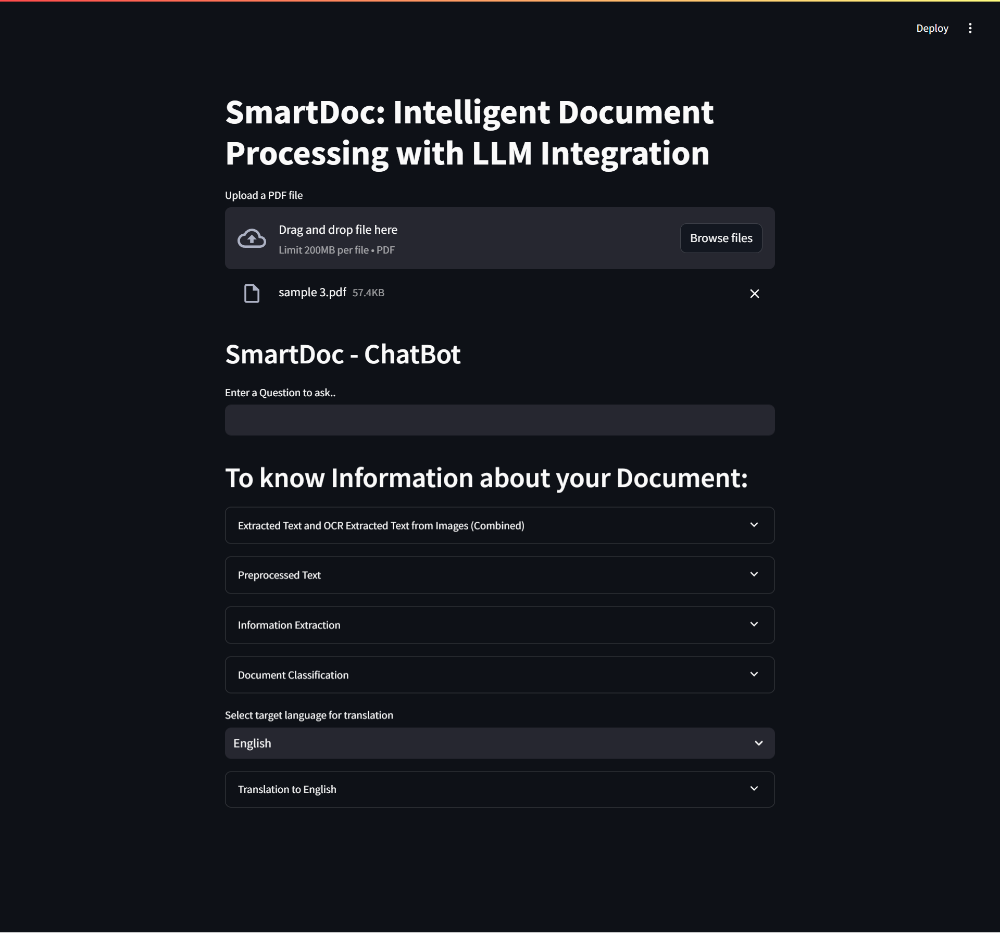

# SmartDoc: Intelligent Document Processing with LLM Integration

SmartDoc is an intelligent document processing system that leverages OCR and LLM integration to convert, analyze, and extract valuable information from PDFs. This project provides a user-friendly interface for comprehensive document understanding, translation, and includes a chatbot for interactive queries.

<div align="center">

</div>

## Features

- **PDF to Text Conversion**: Extract text from PDF files using PyMuPDF.
- **OCR Integration**: Extract text from images within PDFs using Tesseract OCR.
- **Text Preprocessing**: Clean, segment, and tokenize text for optimal LLM performance.
- **Information Extraction**: Identify and extract entities, relationships, and summarize key information using Gemini LLM.
- **Document Classification**: Classify documents into predefined categories.
- **Translation**: Translate extracted text into different languages.
- **Interactive Interface**: User-friendly Streamlit interface for easy interaction.
- **Chatbot Integration**: Ask questions and interact with the extracted data using a conversational chatbot powered by Gemini LLM.

## Installation

1. **Clone the repository**:
    ```bash
    git clone https://github.com/rsharvesh16/SmartDoc-Document-Processing-With-LLM.git
    cd SmartDoc-Document-Processing-With-LLM
    ```

2. **Set up a virtual environment**:
    ```bash
    python -m venv venv
    source venv/bin/activate  # On Windows, use `venv\Scripts\activate`
    ```

3. **Install the required packages**:
    ```bash
    pip install -r requirements.txt
    ```

4. **Set up environment variables**:
    - Create a `.env` file in the project root and add your Gemini LLM API key:
    ```dotenv
    GOOGLE_API_KEY=your_google_api_key
    ```

5. **Configure Tesseract and Poppler paths**:
    - Ensure Tesseract OCR is installed and its path is correctly set in the code:
    ```python
    pytesseract.pytesseract.tesseract_cmd = r'Your Tesseract Path'
    ```
    - Ensure Poppler is installed and its path is correctly set in the code:
    ```python
    pages = convert_from_path("temp.pdf", 500, poppler_path=r'Your Poppler Path')
    ```

## Usage

1. **Run the Streamlit application**:
    ```bash
    streamlit run app.py
    ```

2. **Open the application in your browser**:
    - The application will be available at `http://localhost:8501`.

3. **Upload a PDF file** for processing and interact with the results through the provided interface.

## Code Structure

- `app.py`: Main Streamlit application file.
- `requirements.txt`: List of required packages.
- `.env`: Environment variables file (not included, create your own).
- `temp.pdf`: Temporary file for uploaded PDF (generated during runtime).

## Functions

- **convert_pdf_to_txt**: Converts PDF to text using PyMuPDF.
- **extract_text_from_images**: Extracts text from images using Tesseract OCR.
- **preprocess_text**: Cleans, segments, and tokenizes text for LLM processing.
- **generate_response**: Calls Gemini LLM to generate responses for prompts.
- **extract_entities**: Extracts entities from text using LLM.
- **extract_relationships**: Extracts relationships between entities using LLM.
- **summarize_text**: Summarizes text using LLM.
- **classify_document**: Classifies document text into predefined categories.
- **translate_text**: Translates text into different languages using LLM.

## Chatbot Integration

SmartDoc includes a chatbot feature that allows you to interact with the extracted data in a conversational manner. You can ask questions about the document. The chatbot leverages the Gemini LLM for generating intelligent and contextual responses.

## Acknowledgements

- [PyMuPDF](https://pymupdf.readthedocs.io/)
- [Tesseract OCR](https://github.com/tesseract-ocr/tesseract)
- [PDF2Image](https://github.com/Belval/pdf2image)
- [NLTK](https://www.nltk.org/)
- [Google Generative AI](https://developers.generativeai.google/)

If you have any further questions or issues, feel free to ask!
